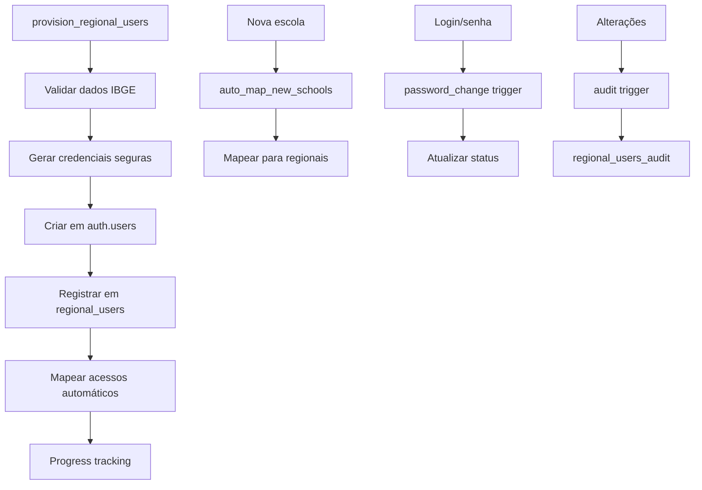

# 📊 Dashboard Max Escola Segura - Gestão

## 🚀 Status do Projeto

**ATUAL**: 🟢 **PRONTO PARA DESENVOLVIMENTO** (09/01/2025)

### ✅ Implementações Concluídas
- **Arquitetura Base**: Next.js 14 + App Router + Supabase
- **Interfaces TypeScript**: 511 linhas com validação Zod
- **Middleware Seguro**: RBAC + Rate Limiting + Headers de segurança
- **Scripts SQL**: 12 arquivos completos com ordem de execução definida
- **Provisionamento Regional**: Estratégia definida e planejada
- **Build Validado**: TypeScript + Next.js funcionando

### 📋 Próximas Etapas
1. **Executar scripts SQL** na ordem definida abaixo
2. **Criar user stories** usando `implementation-docs/Stories/prompt-po.md`
3. **Implementar componentes** seguindo `implementation-docs/implementation-plan/action-plan-V3.md`
4. **Deploy** em Vercel + Supabase Edge Functions

## 📋 Scripts SQL - Ordem de Execução

### **ANÁLISE DE DEPENDÊNCIAS**

**Scripts Analisados**: 12 arquivos SQL  
**Método**: Análise de dependências por referências cruzadas  
**Total de Linhas**: 5.847 linhas de código SQL

### **⚠️ ORDEM OBRIGATÓRIA DE EXECUÇÃO**

#### **FASE 1: Fundação (CRÍTICO - EXECUTAR PRIMEIRO)**
```sql
-- 1. security-fixes.sql (372 linhas)
-- Por que primeiro: Define validate_user_session() e validate_schema_access()
-- Dependências: Nenhuma
-- Usado por: TODOS os RPCs de dashboard
```

```sql
-- 2. tabelas-adequacoes.sql (446 linhas) 
-- Por que segundo: Cria role_permissions, user_tenant_mapping
-- Dependências: validate_user_session() (do script 1)
-- Usado por: middleware_helpers.sql, todos os RPCs
```

#### **FASE 2: Middleware (ANTES DOS INDICADORES)**
```sql
-- 3. middleware_helpers.sql (345 linhas)
-- Por que terceiro: Define get_user_role_info() usado pelo src/middleware.ts
-- Dependências: role_permissions, user_tenant_mapping (do script 2)
-- Usado por: Next.js middleware para autenticação
```

#### **FASE 3: Indicadores (PODEM SER PARALELOS)**
```sql
-- 4. rpc_dashboard_presenca.sql (581 linhas)
-- 5. rpc_dashboard_denuncias.sql (713 linhas) 
-- 6. rpc_dashboard_socioemocional.sql (678 linhas)
-- Dependências: validate_user_session(), validate_schema_access() (script 1)
-- Podem executar: Em qualquer ordem entre si
```

#### **FASE 4: Usuários Regionais (OPCIONAL)**
```sql
-- 7. regional_users_table.sql (123 linhas) - Tabela base
-- 8. regional_user_helpers.sql (330 linhas) - Funções auxiliares
-- 9. provision_regional_users.sql (394 linhas) - RPC principal  
-- 10. regional_users_triggers.sql (329 linhas) - Triggers
-- 11. regional_users_indexes.sql (194 linhas) - Índices
-- Dependências: Apenas entre si (executar na ordem acima)
```

#### **FASE 5: Configurações Finais**
```sql
-- 12. rpc_setup_configuracoes.sql (769 linhas)
-- Por que último: Configurações e setup inicial do sistema
-- Dependências: TODOS os scripts anteriores
```

### **Comando Completo de Execução**
```bash
# No Supabase SQL Editor, executar na ordem exata:
psql -f implementation-docs/RPCs/security-fixes.sql
psql -f implementation-docs/RPCs/tabelas-adequacoes.sql  
psql -f implementation-docs/RPCs/middleware_helpers.sql
psql -f implementation-docs/RPCs/rpc_dashboard_presenca.sql
psql -f implementation-docs/RPCs/rpc_dashboard_denuncias.sql
psql -f implementation-docs/RPCs/rpc_dashboard_socioemocional.sql
# Scripts regionais (se necessário):
psql -f implementation-docs/RPCs/regional_users_table.sql
psql -f implementation-docs/RPCs/regional_user_helpers.sql
psql -f implementation-docs/RPCs/provision_regional_users.sql
psql -f implementation-docs/RPCs/regional_users_triggers.sql
psql -f implementation-docs/RPCs/regional_users_indexes.sql
# Configurações finais:
psql -f implementation-docs/RPCs/rpc_setup_configuracoes.sql
```

### **Validação Após Cada Fase**
```sql
-- Testar após Fase 1 (Fundação)
SELECT 'security-fixes' as fase, COUNT(*) as funcoes FROM pg_proc WHERE proname LIKE 'validate_%';
-- Resultado esperado: 2 funções (validate_user_session, validate_schema_access)

-- Testar após Fase 2 (Tabelas)
SELECT 'tabelas' as fase, COUNT(*) as tabelas FROM information_schema.tables WHERE table_name LIKE 'role_%';
-- Resultado esperado: 2+ tabelas (role_permissions, role_categoria_denuncia)

-- Testar após Fase 3 (Middleware)
SELECT 'middleware' as fase, COUNT(*) as funcoes FROM pg_proc WHERE proname = 'get_user_role_info';
-- Resultado esperado: 1 função

-- Testar após Fase 4 (Indicadores)
SELECT 'indicadores' as fase, COUNT(*) as rpcs FROM pg_proc WHERE proname LIKE 'rpc_dashboard_%';
-- Resultado esperado: 3+ RPCs de dashboard
```

## 🔧 Implementações Técnicas Recentes

### **TypeScript Interfaces** (`src/types/dashboard.ts`)
- **4 indicadores completos**: Presença, Denúncias Educacionais, Socioemocional, Segurança
- **511 linhas**: Interfaces profissionais com validação Zod
- **Dimensões corrigidas**: Baseadas na estrutura real (Colegas, Humor, Professores, Saúde)
- **Props para componentes**: Chart components + Realtime
- **Validação runtime**: Schemas Zod para todas as APIs
- **Constantes**: Cores padronizadas e configurações

### **Middleware Expandido** (`src/middleware.ts`)
- **303 linhas**: RBAC dinâmico via RPC get_user_role_info()
- **Rate limiting**: 100 req/min por usuário (in-memory)
- **Headers de segurança**: CSP, XSS Protection, HSTS, CSRF
- **Validação de rotas**: Baseada em roles e permissões
- **Redirecionamentos**: Automáticos baseados em acesso
- **Logging**: Headers customizados para debugging

### **Scripts SQL Organizados** (`implementation-docs/RPCs/`)
- **12 arquivos**: 5.847 linhas totais de código SQL
- **Ordem definida**: Baseada em análise rigorosa de dependências
- **Validação completa**: Comandos de teste para cada fase
- **Segurança robusta**: RLS, validações, rate limiting
- **Performance otimizada**: Índices e chunking para grandes volumes

## 📁 Estrutura de Arquivos Atualizada

### **Arquivos Principais**
```
src/
├── types/dashboard.ts          # 511 linhas - Interfaces completas + Zod
├── middleware.ts               # 303 linhas - RBAC + Segurança + Rate Limiting
├── app/page.tsx               # Server Component - Dashboard inicial
├── lib/supabase/              # Clientes Supabase (browser/server)
└── features/dashboard/        # Controllers de API (migração de Igniter.js)

implementation-docs/
├── RPCs/                      # 12 scripts SQL (5.847 linhas)
│   ├── security-fixes.sql     # FASE 1 - Funções de segurança
│   ├── tabelas-adequacoes.sql # FASE 1 - Tabelas base
│   ├── middleware_helpers.sql # FASE 2 - RPCs para middleware
│   ├── rpc_dashboard_*.sql    # FASE 3 - Indicadores (3 arquivos)
│   ├── regional_users_*.sql   # FASE 4 - Usuários regionais (5 arquivos)
│   └── rpc_setup_configuracoes.sql # FASE 5 - Configurações finais
├── Stories/
│   ├── prompt-po.md          # Prompt para Product Owner
│   └── regional-users-implementation-summary.md # Resumo executivo
└── implementation-plan/
    └── action-plan-V3.md     # Plano completo (404 linhas)
```

## 📊 Dashboard Max Escola Segura

Sistema de dashboards educacionais multi-tenant com controle de acesso baseado em roles para monitoramento em tempo real de indicadores escolares.

## 🎯 Visão Geral

Dashboard de gestão para o projeto Max Escola Segura com 4 níveis de acesso distintos:

- **DIRETORIA**: Visualiza dados exclusivamente de sua escola
- **SEC_EDUC_MUN**: Visualiza dados de escolas municipais do município
- **SEC_EDUC_EST**: Visualiza dados de escolas estaduais do estado  
- **SEC_SEG_PUB**: Visualiza denúncias de segurança de escolas municipais e estaduais

### Indicadores Disponíveis

1. **📊 Presença Escolar** - Taxa de alunos presentes em tempo real
2. **📋 Denúncias Educacionais** - Bullying, infraestrutura e outros
3. **💭 Monitoramento Socioemocional** - Bem-estar dos alunos por dimensões
4. **🚨 Denúncias de Segurança** - Tráfico, assédio, discriminação e violência (exclusivo SEC_SEG_PUB)

## 🛠️ Stack Tecnológica

### Frontend
- **Framework**: Next.js 14+ com App Router
- **UI Components**: shadcn/ui + Recharts
- **Styling**: Tailwind CSS
- **Type Safety**: TypeScript + Zod
- **Deploy**: Vercel

### Backend
- **Database**: PostgreSQL (Supabase) multi-tenant
- **Auth**: Supabase Auth com RBAC
- **Realtime**: Supabase Realtime
- **Edge Functions**: Supabase Edge Functions
- **Security**: RLS + Rate Limiting

## 🚀 Quick Start

### Pré-requisitos
- Node.js 18+
- Conta Supabase com projeto configurado
- PostgreSQL com estrutura multi-tenant

### Instalação

1. Clone o repositório:
    ```bash
git clone https://github.com/IntuitivePhella/max-escolasegura-dashboard-gestao.git
cd max-escolasegura-dashboard-gestao
    ```

2. Instale as dependências:
    ```bash
    npm install
    ```

3. Configure as variáveis de ambiente:
```bash
cp .env.example .env.local
```

Edite `.env.local`:
    ```env
NEXT_PUBLIC_SUPABASE_URL=your_supabase_url
NEXT_PUBLIC_SUPABASE_ANON_KEY=your_anon_key
SUPABASE_SERVICE_ROLE_KEY=your_service_role_key
```

4. Execute as migrations do banco:
    ```bash
npm run db:migrate
    ```

5. Inicie o servidor de desenvolvimento:
    ```bash
    npm run dev
    ```

Acesse http://localhost:3000

## 🏗️ Arquitetura

### Estrutura do Projeto (App Router)

```
app/
├── (auth)/
│   ├── login/
│   │   ├── page.tsx
│   │   └── loading.tsx
│   └── layout.tsx
├── (dashboard)/
│   ├── layout.tsx              # Layout com sidebar/header
│   ├── page.tsx                # Dashboard principal
│   ├── loading.tsx             
│   ├── error.tsx               
│   ├── components/
│   │   ├── presence-chart.tsx
│   │   ├── complaints-chart.tsx
│   │   ├── security-complaints-chart.tsx
│   │   ├── emotional-chart.tsx
│   │   └── school-selector.tsx
│   └── [schoolId]/
│       └── page.tsx
├── api/
│   └── dashboard/
│       ├── presence/route.ts
│       ├── complaints/route.ts
│       ├── security/route.ts
│       └── emotional/route.ts
└── layout.tsx

components/
├── ui/                         # shadcn/ui components
└── charts/                     # Chart wrappers
```

### Fluxo de Dados

1. **Autenticação**: Login via Supabase Auth
2. **Autorização**: Middleware valida role via `user_tenant_mapping`
3. **Data Fetching**: Server Components + Route Handlers
4. **Realtime**: Supabase subscriptions com auto-refetch
5. **Caching**: Edge Functions para agregações pesadas

## 🔐 Segurança e RBAC

### Controle de Acesso

```sql
-- Tabela de mapeamento usuário-tenant-role
public.user_tenant_mapping (
  user_id UUID,
  schema_name TEXT,
  role TEXT CHECK (role IN ('DIRETORIA', 'SEC_EDUC_MUN', 'SEC_EDUC_EST', 'SEC_SEG_PUB')),
  special_role_id INTEGER,
  status TEXT DEFAULT 'ATIVO'
)

-- Role permissions define acesso a features
public.role_permissions (
  id SERIAL PRIMARY KEY,
  role_type TEXT,
  permissions JSONB
)

-- Categorias de denúncia por role
public.role_categoria_denuncia (
  role_type TEXT,
  categoria TEXT,
  ativo BOOLEAN
)
```

### Funções de Segurança

- `validate_schema_access()` - Previne SQL injection
- `validate_user_session()` - Validação robusta de sessão
- `check_rate_limit()` - Rate limiting por endpoint

### Provisionamento de Usuários Regionais

**Usuários criados automaticamente**:
- **SEC_EDUC_MUN**: ~2.859 usuários (1 por município com escolas municipais)
- **SEC_EDUC_EST**: 7 usuários (1 por estado)
- **SEC_SEG_PUB**: 7 usuários (1 por estado)
- **Total**: ~2.873 usuários regionais

**Executar provisionamento após setup inicial**:
```bash
# Via npm script
npm run db:provision-users

# Ou diretamente no banco
psql -c "SELECT * FROM provision_regional_users();"
```

**Tabela de controle**:
```sql
public.regional_users (
  id SERIAL PRIMARY KEY,
  email VARCHAR(255) UNIQUE,
  role VARCHAR(50),
  co_uf VARCHAR(2),
  co_municipio VARCHAR(7),
  auth_user_id UUID,
  status VARCHAR(20),
  password_changed BOOLEAN
)

## 🏗️ Arquitetura Implementada

### Provisionamento de Usuários Regionais

O sistema implementa uma arquitetura robusta para criação automática de usuários regionais baseada em dados geográficos do INEP.



### Componentes da Arquitetura

#### 1. **Tabela Central**: `public.regional_users`
- Controle completo de usuários regionais
- Integração com `auth.users` via `auth_user_id`
- Dados geográficos (UF, município) para mapeamento
- Status e controle de senhas temporárias

#### 2. **RPC Principal**: `provision_regional_users()`
- Provisionamento em lote com chunking (100 usuários/vez)
- Progress tracking em tempo real
- Rollback automático em caso de falha
- Modo dry-run para testes

#### 3. **Sistema de Triggers**
- **Sincronização**: Mantém `user_tenant_mapping` atualizado
- **Auditoria**: Registra todas as alterações
- **Auto-mapeamento**: Conecta novas escolas automaticamente
- **Senha**: Monitora trocas de senha temporária

#### 4. **Mapeamento de Acessos**
- **SEC_EDUC_MUN**: Escolas municipais do município
- **SEC_EDUC_EST**: Escolas estaduais do estado
- **SEC_SEG_PUB**: Todas as escolas do estado

## 🔒 Segurança Implementada

### 1. 🔐 **Senhas Temporárias Seguras**
```
Padrão: SecMun4208302#a1b2@MES2024
- Prefixo baseado no role (SecMun, SecEst, SecSeg)
- Código geográfico (município/UF)
- 4 caracteres aleatórios
- Sufixo com ano (@MES2024)
- Limpeza automática após primeira troca
```

### 2. 🛡️ **Validações Robustas**
- **Email**: Formato obrigatório `@maxescolasegura.com.br`
- **Códigos IBGE**: Validação contra `registro_inep`
- **Unicidade**: `UNIQUE(role, co_uf, co_municipio)`
- **Integridade**: Validação role vs dados geográficos

### 3. 📝 **Auditoria Completa**
```sql
-- Tabela de auditoria com triggers automáticos
public.regional_users_audit (
  action VARCHAR(10),        -- INSERT, UPDATE, DELETE
  user_id UUID,             -- Usuário alterado
  changed_by UUID,          -- Quem fez a alteração
  changed_at TIMESTAMP,     -- Quando
  old_data JSONB,           -- Estado anterior
  new_data JSONB            -- Estado novo
)
```

### 4. ⚡ **Performance Otimizada**
- **Chunking**: 100 usuários por vez (evita timeout)
- **20+ Índices**: Queries otimizadas para < 2s
- **Views de monitoramento**: Acompanhamento de performance
- **RLS**: Row Level Security ativo

## ✅ Execução e Validação

### Scripts de Deploy

#### 1. **Instalação** (ordem obrigatória)
```bash
# 1. Executar scripts SQL na ordem
psql -f implementation-docs/RPCs/regional_users_table.sql
psql -f implementation-docs/RPCs/regional_user_helpers.sql
psql -f implementation-docs/RPCs/provision_regional_users.sql
psql -f implementation-docs/RPCs/regional_users_triggers.sql
psql -f implementation-docs/RPCs/regional_users_indexes.sql
```

#### 2. **Teste Dry-Run**
```sql
-- Simula provisionamento sem persistir
SELECT * FROM provision_regional_users(100, TRUE);

-- Resultado esperado:
-- total_expected: ~2873
-- total_success: ~2873
-- total_errors: 0
-- execution_time_ms: < 60000
```

#### 3. **Execução Real**
```sql
-- Provisiona todos os usuários regionais
SELECT * FROM provision_regional_users();

-- Validar criação por role
SELECT role, COUNT(*) as total
FROM regional_users 
GROUP BY role;
-- Esperado: SEC_EDUC_MUN: ~2859, SEC_EDUC_EST: 7, SEC_SEG_PUB: 7
```

### Validação Pós-Deploy

#### **Verificar Mapeamentos**
```sql
-- Top 10 usuários com mais escolas mapeadas
SELECT 
    ru.role,
    ru.email,
    COUNT(utm.id) as escolas_mapeadas
FROM regional_users ru
LEFT JOIN user_tenant_mapping utm ON ru.auth_user_id = utm.user_id
GROUP BY ru.role, ru.email
ORDER BY COUNT(utm.id) DESC
LIMIT 10;
```

#### **Monitorar Performance**
```sql
-- Verificar uso de índices
SELECT * FROM v_regional_users_index_usage;

-- Identificar queries lentas
SELECT * FROM v_regional_users_slow_queries;
```

#### **Auditoria de Criação**
```sql
-- Verificar logs de criação
SELECT action, COUNT(*) as total
FROM regional_users_audit
WHERE changed_at >= NOW() - INTERVAL '1 day'
GROUP BY action;
```

### Critérios de Sucesso
- ✅ **Provisionamento**: 100% usuários criados sem erro
- ✅ **Mapeamento**: Escolas associadas corretamente
- ✅ **Performance**: Execução < 60 segundos
- ✅ **Segurança**: RLS e validações ativas
- ✅ **Auditoria**: Logs registrados

### Comandos de Manutenção

#### **Monitoramento Semanal**
```sql
-- Usuários que não fizeram primeiro login
SELECT role, COUNT(*) 
FROM regional_users 
WHERE password_changed = FALSE
GROUP BY role;

-- Performance de índices
SELECT * FROM v_regional_users_index_usage 
WHERE index_scans = 0;
```

#### **Reindexação Mensal**
```sql
-- Apenas se necessário (verificar bloat primeiro)
REINDEX TABLE CONCURRENTLY public.regional_users;
REINDEX TABLE CONCURRENTLY public.user_tenant_mapping;
```

## 📡 API Endpoints

### Dashboard APIs

```typescript
// Presença escolar
GET /api/dashboard/presence
Response: { 
  schools: [{ 
    name, 
    present: number, 
    total: number, 
    percentage: number 
  }] 
}

// Denúncias educacionais  
GET /api/dashboard/complaints
Response: { 
  months: [{ 
    month, 
    bullying: { treated, pending },
    infrastructure: { treated, pending }
  }] 
}

// Denúncias de segurança (SEC_SEG_PUB only)
GET /api/dashboard/security
Response: { 
  months: [{ 
    month,
    categories: { 
      traffic, harassment, 
      discrimination, violence 
    }
  }] 
}

// Monitoramento socioemocional
GET /api/dashboard/emotional
Response: { 
  dimensions: [{ 
    name, 
    score, 
    trend 
  }] 
}
```

## 🚀 Deploy

### Frontend (Vercel)

```bash
# Deploy automático via GitHub
git push origin main

# Deploy manual
vercel --prod
```

### Edge Functions (Supabase)

```bash
# Deploy todas as functions
npm run deploy:functions

# Deploy específica
supabase functions deploy process-user-provisioning
```

## 📊 Monitoramento

- **Frontend**: Vercel Analytics + Web Vitals
- **Backend**: Supabase Dashboard + Logs
- **Errors**: Sentry integration
- **Uptime**: Status page

## 🧪 Testes

```bash
# Testes unitários
npm run test

# Testes E2E
npm run test:e2e

# Testes de carga
npm run test:load
```

## 📚 Documentação

- [Plano de Implementação](./implementation-docs/action-plan-V3.md)
- [Arquitetura do Banco](./implementation-docs/database-schema.md)
- [Guia de Contribuição](./CONTRIBUTING.md)
- [Changelog](./CHANGELOG.md)

## 🚀 Início do Desenvolvimento

### Para Product Owner / Scrum Master

Antes de iniciar o desenvolvimento, execute:

1. **Criar User Stories**: Use o prompt preparado em:
   ```
   implementation-docs/Stories/prompt-po.md
   ```
   
2. **Executar o prompt com @po**:
   ```
   @po [conteúdo do prompt-po.md]
   ```

3. **Resultado esperado**: 5 épicos com user stories detalhadas organizadas por prioridade

### Para Desenvolvedores

Após as user stories estarem prontas:

1. **Backend First**: Comece pelo Epic 1 (Backend Base)
2. **Ambiente Local**: Configure conforme seção "Quick Start"
3. **Incremental**: Implemente story por story seguindo dependências
4. **Validação**: Teste cada indicador isoladamente

### Estrutura de Desenvolvimento

```
implementation-docs/
├── action-plan-V3.md          # Plano aprovado
├── Stories/
│   ├── prompt-po.md           # Prompt para criar stories ⭐
│   ├── Epic-01-Backend-Base.md
│   ├── Epic-02-Frontend-Base.md
│   ├── Epic-03-Components-Integration.md
│   ├── Epic-04-Edge-Functions.md
│   └── Epic-05-Refinements.md
├── RPCs/                      # Scripts SQL (se implementados)
└── sql/                       # Migrations consolidadas
```

## 📚 Documentação

## 🤝 Contribuindo

1. Fork o projeto
2. Crie sua feature branch (`git checkout -b feature/AmazingFeature`)
3. Commit suas mudanças (`git commit -m 'Add some AmazingFeature'`)
4. Push para a branch (`git push origin feature/AmazingFeature`)
5. Abra um Pull Request

## 📄 Licença

Este projeto é proprietário e confidencial. Todos os direitos reservados.

---

**Status**: 🟢 **PRONTO PARA DESENVOLVIMENTO**  
**Versão**: 1.0.0-rc  
**Última Atualização**: 09 de Janeiro de 2025

## 📚 Documentação Completa

- **[Plano de Ação V3](./implementation-docs/implementation-plan/action-plan-V3.md)** - Plano completo (404 linhas)
- **[Prompt para Product Owner](./implementation-docs/Stories/prompt-po.md)** - Criação de user stories
- **[Resumo de Usuários Regionais](./implementation-docs/Stories/regional-users-implementation-summary.md)** - Estratégia de provisionamento

## 🎯 Marcos Importantes

- **✅ 09/01/2025**: Arquitetura base implementada
- **✅ 09/01/2025**: Scripts SQL organizados (5.847 linhas)  
- **✅ 09/01/2025**: Interfaces TypeScript completas (511 linhas)
- **✅ 09/01/2025**: Middleware com RBAC implementado (303 linhas)
- **📋 Próximo**: Execução de scripts SQL e desenvolvimento de componentes
