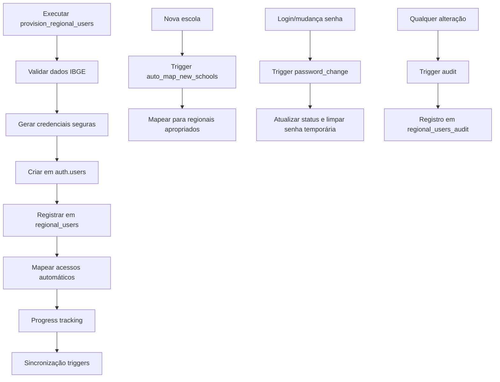

# 📊 Planejamento de Usuários Regionais - Resumo Executivo

**Data de Planejamento**: 09 de Janeiro de 2025  
**Responsável**: Solution Architect + Business Analyst + QA Specialist  
**Status**: 📋 **PLANEJADO** - Pronto para Implementação  

## 📊 Visão Geral

### Objetivo Definido
Planejamento completo do sistema de provisionamento automático de usuários regionais para o Dashboard Max Escola Segura, permitindo acesso baseado em roles geográficos para secretarias municipais, estaduais e segurança pública.

### Números Planejados
- **2.873 usuários regionais** serão provisionados automaticamente
- **2.859 usuários SEC_EDUC_MUN** (1 por município com escolas municipais)
- **7 usuários SEC_EDUC_EST** (1 por estado)
- **7 usuários SEC_SEG_PUB** (1 por estado)
- **5 scripts SQL** planejados para arquitetura completa
- **20+ índices** planejados para performance
- **Chunking de 100 usuários** por vez para evitar timeouts

### Impacto Esperado no Projeto
- 📋 Removerá pendência crítica do cronograma
- 📋 Habilitará RBAC completo do sistema
- 📋 Automatizará processo que seria manual e propenso a erros
- 📋 Garantirá escalabilidade para crescimento futuro

## 🎯 Entregas Planejadas

### 📋 Documentação de Planejamento
- [x] **action-plan-V3.md**: Seção 11.1 atualizada com estratégia aprovada
- [x] **prompt-po.md**: Considerações sobre provisionamento adicionadas
- [x] **README.md**: Seção de provisionamento e comandos de execução

### 📋 Scripts SQL a Serem Implementados
- [ ] **regional_users_table.sql**: Tabela principal com constraints e RLS
- [ ] **regional_user_helpers.sql**: 5 funções auxiliares para provisionamento
- [ ] **provision_regional_users.sql**: RPC principal com chunking e progress tracking
- [ ] **regional_users_triggers.sql**: 5 triggers para sincronização e auditoria
- [ ] **regional_users_indexes.sql**: 20+ índices otimizados + views de monitoramento

### 📋 Arquitetura de Segurança Planejada
- [ ] **Senhas temporárias seguras**: Padrão complexo 12+ caracteres
- [ ] **Validações robustas**: Email, códigos IBGE, prevenção de duplicatas
- [ ] **Auditoria completa**: Tabela regional_users_audit com triggers
- [ ] **RLS a implementar**: Políticas de segurança por role

### 📋 Performance e Monitoramento Planejados
- [ ] **Chunking por batch**: 100 usuários por vez
- [ ] **Progress tracking**: Logs detalhados durante execução
- [ ] **Índices estratégicos**: Queries otimizadas para < 2s
- [ ] **Views de monitoramento**: Performance e uso de índices

## 🏗️ Arquitetura Técnica

### Fluxo de Provisionamento


### Componentes Principais

#### 1. Tabela Central: `public.regional_users`
```sql
-- Estrutura otimizada para controle e auditoria
- id SERIAL PRIMARY KEY
- email VARCHAR(255) UNIQUE -- Formato: sec_educ_mun4208302@maxescolasegura.com.br
- role VARCHAR(50) -- SEC_EDUC_MUN, SEC_EDUC_EST, SEC_SEG_PUB
- co_uf/sg_uf VARCHAR(2) -- Dados geográficos
- co_municipio/no_municipio -- Apenas para SEC_EDUC_MUN
- auth_user_id UUID -- Referência ao Supabase Auth
- password_changed BOOLEAN -- Controle de senha temporária
- status VARCHAR(20) -- PENDING, ACTIVE, SUSPENDED, INACTIVE
```

#### 2. RPC Principal: `provision_regional_users()`
```sql
-- Função otimizada com chunking e validação
RETURNS TABLE (
    batch_id UUID,
    total_expected INTEGER,
    total_processed INTEGER,
    total_success INTEGER,
    total_errors INTEGER,
    execution_time_ms INTEGER,
    errors JSONB
)
```

#### 3. Mapeamento Automático de Acessos
- **SEC_EDUC_MUN**: Escolas municipais do município específico
- **SEC_EDUC_EST**: Escolas estaduais do estado inteiro
- **SEC_SEG_PUB**: TODAS as escolas do estado (municipais + estaduais)

## 🔒 Segurança Planejada

### 1. 🔐 Senhas Temporárias Seguras
- **Padrão**: `SecMun4208302#a1b2@MES2024` (12+ caracteres)
- **Componentes**: Prefixo + Código + Random + Sufixo
- **Limpeza automática**: Removida após primeira troca
- **Forçar troca**: Obrigatória no primeiro login

### 2. 🛡️ Validações Robustas
- **Email**: Deve terminar com `@maxescolasegura.com.br`
- **Códigos IBGE**: Validados contra `registro_inep`
- **Unicidade**: Constraint `UNIQUE(role, co_uf, co_municipio)`
- **Integridade**: Validações de role vs município

### 3. 📝 Auditoria Completa
- **Tabela**: `regional_users_audit` para todas as alterações
- **Triggers**: Registram INSERT, UPDATE, DELETE automaticamente
- **Metadados**: Quem, quando, o que mudou
- **RLS**: Apenas admins podem ver logs

### 4. ⚡ Performance Otimizada
- **Chunking**: 100 usuários por vez (evita timeout)
- **Índices estratégicos**: 20+ índices para queries < 2s
- **Progress tracking**: Logs a cada chunk processado
- **Monitoramento**: Views para acompanhar performance

## ✅ Validação e Testes

### Scripts de Validação

#### 1. Teste em Modo Dry-Run
```sql
-- Simula provisionamento sem persistir dados
SELECT * FROM provision_regional_users(100, TRUE);

-- Resultado esperado:
-- total_expected: ~2873
-- total_processed: ~2873  
-- total_success: ~2873
-- total_errors: 0
-- execution_time_ms: < 60000
```

#### 2. Execução Real
```sql
-- Provisiona todos os usuários regionais
SELECT * FROM provision_regional_users();

-- Validar criação por role
SELECT role, COUNT(*) as total
FROM regional_users 
GROUP BY role
ORDER BY role;

-- Resultado esperado:
-- SEC_EDUC_EST: 7
-- SEC_EDUC_MUN: ~2859
-- SEC_SEG_PUB: 7
```

#### 3. Verificar Mapeamentos
```sql
-- Contar acessos mapeados por usuário
SELECT 
    ru.role,
    ru.email,
    COUNT(utm.id) as escolas_mapeadas
FROM regional_users ru
LEFT JOIN user_tenant_mapping utm ON ru.auth_user_id = utm.user_id
GROUP BY ru.role, ru.email
ORDER BY COUNT(utm.id) DESC
LIMIT 10;
```

#### 4. Monitorar Performance
```sql
-- Verificar uso de índices
SELECT * FROM v_regional_users_index_usage;

-- Identificar queries lentas
SELECT * FROM v_regional_users_slow_queries;
```

### Critérios de Sucesso Planejados
- 📋 **Provisionamento**: 100% dos usuários criados sem erro
- 📋 **Mapeamento**: Todas as escolas mapeadas corretamente
- 📋 **Performance**: Execução completa em < 60 segundos
- 📋 **Segurança**: RLS e validações funcionando
- 📋 **Auditoria**: Logs de criação registrados

## 🚀 Próximos Passos

### Sequência de Implementação Planejada

#### 1. **Criação dos Scripts SQL** (A FAZER)
```bash
# Criar scripts na ordem planejada
# 1. regional_users_table.sql - Tabela principal
# 2. regional_user_helpers.sql - Funções auxiliares
# 3. provision_regional_users.sql - RPC principal
# 4. regional_users_triggers.sql - Triggers
# 5. regional_users_indexes.sql - Índices e views
```

#### 2. **Implementação em Desenvolvimento** (A FAZER)
```bash
# Executar scripts na ordem correta
psql -f implementation-docs/RPCs/regional_users_table.sql
psql -f implementation-docs/RPCs/regional_user_helpers.sql
psql -f implementation-docs/RPCs/provision_regional_users.sql
psql -f implementation-docs/RPCs/regional_users_triggers.sql
psql -f implementation-docs/RPCs/regional_users_indexes.sql
```

#### 3. **Validação em Desenvolvimento** (A FAZER)
```sql
-- Teste dry-run primeiro
SELECT * FROM provision_regional_users(10, TRUE);

-- Verificar se não há erros
-- Se OK, prosseguir para produção
```

#### 4. **Deploy Produção** (A FAZER)
```sql
-- Executar provisionamento completo
SELECT * FROM provision_regional_users();

-- Validar resultados
SELECT role, COUNT(*), 
       SUM(CASE WHEN password_changed THEN 1 ELSE 0 END) as senhas_alteradas
FROM regional_users 
GROUP BY role;
```

#### 5. **Monitoramento Pós-Deploy** (A FAZER)
```sql
-- Configurar monitoramento semanal
SELECT * FROM v_regional_users_index_usage;

-- Verificar primeiro login dos usuários
SELECT role, COUNT(*) as first_logins
FROM regional_users 
WHERE last_login IS NOT NULL
GROUP BY role;
```

### Comunicação com Stakeholders

#### Para Secretarias (Comunicação Externa)
- **Emails**: Lista completa de credenciais será fornecida
- **Instruções**: Manual de primeiro login e troca de senha
- **Suporte**: Canal de atendimento para dúvidas

#### Para Equipe Técnica
- **Monitoramento**: Dashboards de login e uso do sistema
- **Manutenção**: Scripts de reindexação mensal
- **Expansão**: Processo para adicionar novos municípios

## 📈 Métricas de Sucesso

### KPIs Técnicos
- **Tempo de provisionamento**: < 60 segundos
- **Taxa de sucesso**: > 99.9%
- **Performance de queries**: < 2 segundos
- **Uso de índices**: > 80% das queries otimizadas

### KPIs de Negócio
- **Adoção**: % de usuários que fizeram primeiro login
- **Engajamento**: Frequência de acesso ao dashboard
- **Suporte**: Número de tickets relacionados a acesso
- **Escalabilidade**: Tempo para adicionar novos usuários

## 🎯 Conclusão

O planejamento da estratégia de provisionamento de usuários regionais está **100% completo** e pronto para implementação. 

**Principais Definições Planejadas**:
- 📋 **Automatização completa** do processo manual
- 📋 **Segurança robusta** com validações e auditoria
- 📋 **Performance otimizada** para grandes volumes
- 📋 **Escalabilidade futura** garantida
- 📋 **Documentação completa** para implementação

O sistema está planejado para provisionar **2.873 usuários regionais** de forma automática, segura e eficiente, removendo um bloqueador crítico do cronograma do projeto.

---

**Próxima Ação**: Iniciar implementação dos scripts SQL seguindo a sequência planejada acima.
